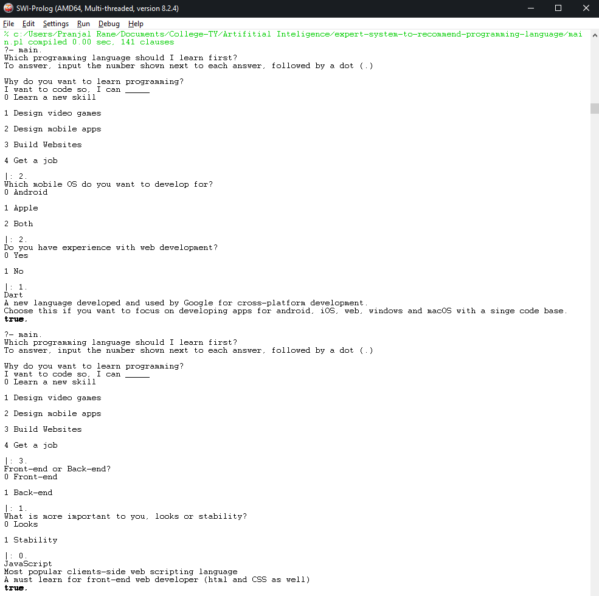

# Expert System to Recommend Programming languages
A basic expert system, written in Prolog, that suggests what programming language one should learn first.

The system is based on the [this](https://drive.google.com/file/d/1yWKp7Tg-0NLQ14_R5jA4ao2kzlAufzEa/view?usp=sharing) infographic.

## Instalation

In order to run this Prolog program you need to have Prolog installed. [Click here](https://www.swi-prolog.org/download/stable) to install.

## Running
1. Clone this code repository.
```bash
git clone https://github.com/TY-Project-Group/expert-system-to-recommend-programming-language.git
```

2. Start a Prolog console loaded with `main.pl`:

```bash
swi-prolog -f main.pl
```

3. Follow the on-screen instructions, to get a programming language recommendation.

## Result

Sample output screenshot :



